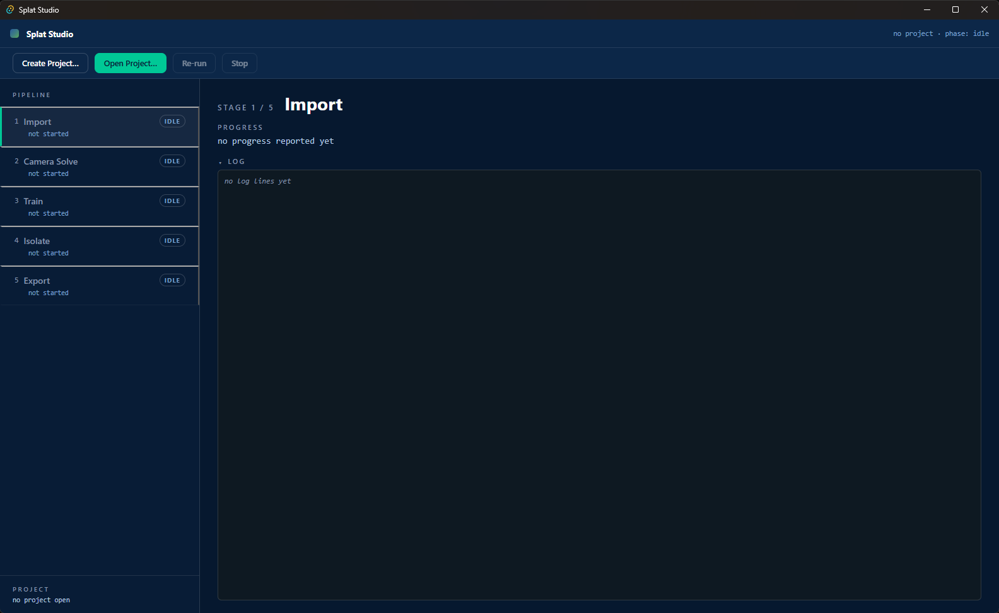
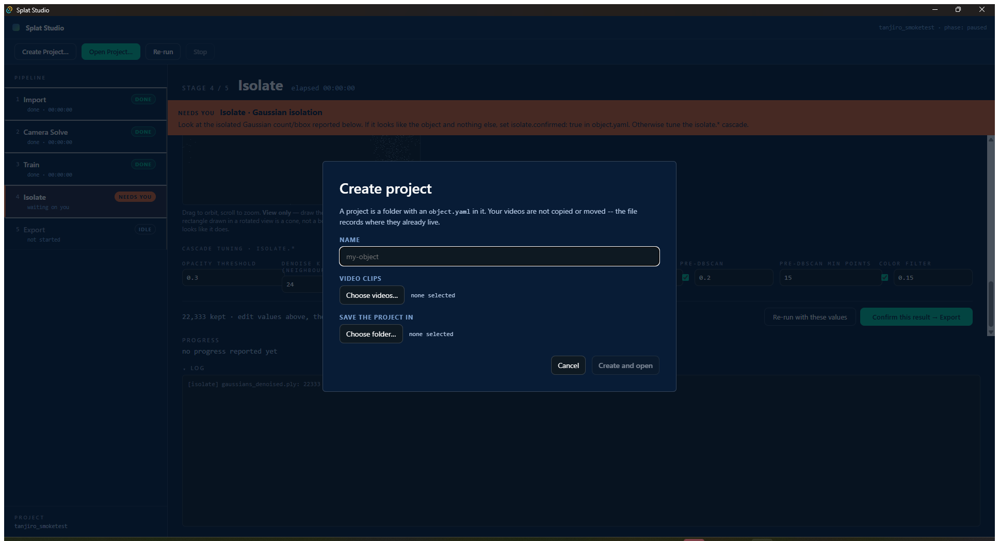
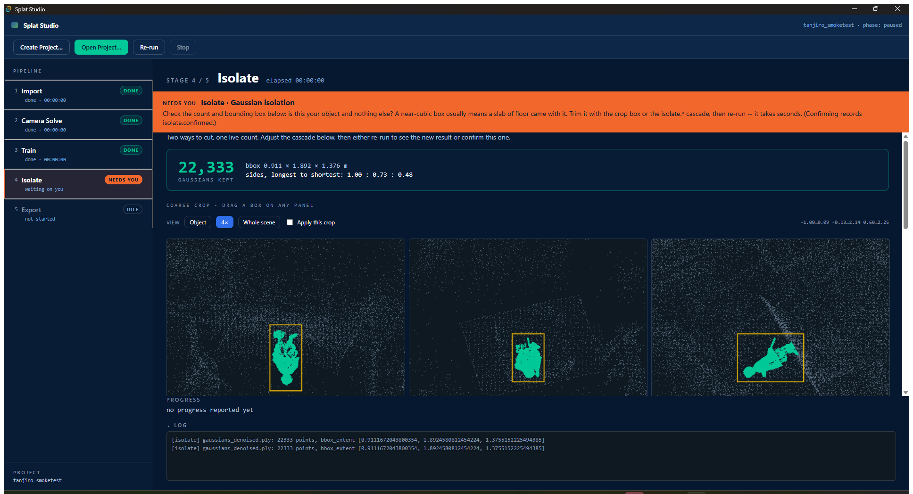
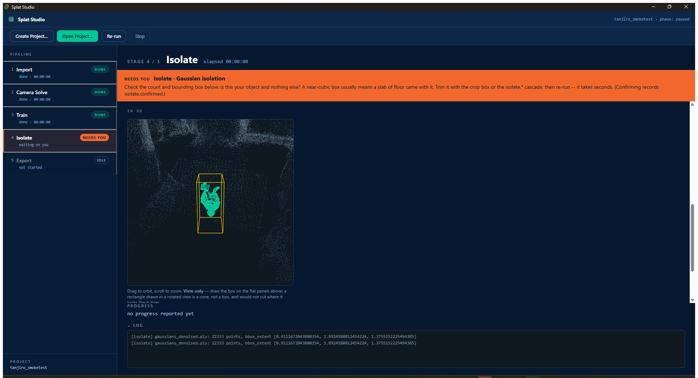
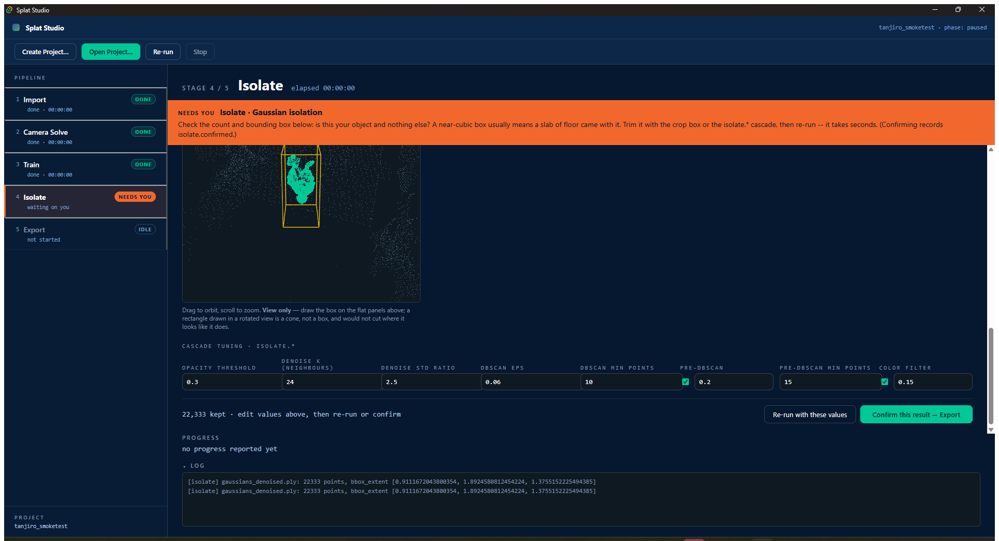
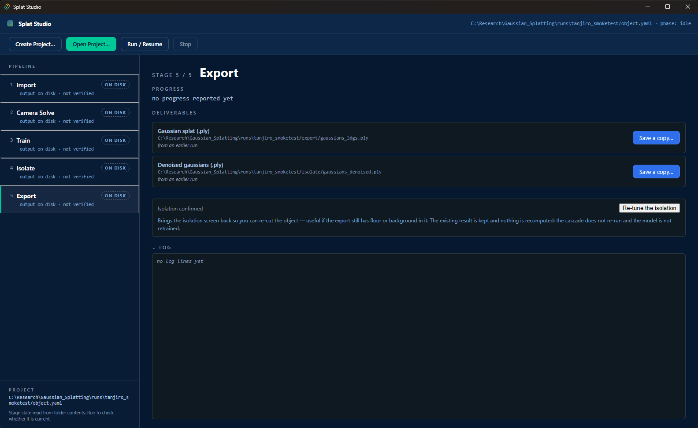

# Using Splat Studio

From a few videos of an object to a 3D Gaussian splat you can open in any
viewer. Start to finish this takes a couple of hours, most of it unattended.

- [Before you start](#before-you-start)
- [1. Create a project](#1-create-a-project)
- [2. Run it](#2-run-it)
- [3. Answer the two questions](#3-answer-the-two-questions)
- [4. Save your splat](#4-save-your-splat)
- [When something goes wrong](#when-something-goes-wrong)

---

## Before you start

### Filming

The whole result depends on this, more than on any setting in the app.

- **Orbit the object.** Walk a full circle around it, twice at different
  heights if you can. The reconstruction needs to see each surface from
  several angles.
- **Keep the object still and the camera moving.** Not the other way round.
  A turntable does not work — the background has to stay fixed relative to
  the object.
- **Even, diffuse light.** Hard shadows move with the camera and get baked
  into the model as if they were paint.
- **Move slowly.** Motion blur is the single most common cause of a failed
  reconstruction, and the app discards the blurriest 15% of frames for
  exactly this reason.
- **Avoid featureless surroundings.** Structure-from-motion locates the
  camera using background detail. A seamless white backdrop gives it
  nothing to work with.
- **Glossy, transparent and very dark objects are hard.** They violate the
  assumption that a surface looks the same from every angle.

Three or four clips of 30–60 seconds each is a good starting point.

### The first launch

Splat Studio opens on an empty pipeline. Nothing is loaded yet, and the five
stages sit idle:

The rail on the left is the whole process, and it is the same five stages
every time:

| stage | what it does | roughly |
|---|---|---|
| **Import** | pulls frames out of your clips and drops the blurry ones | minutes |
| **Camera Solve** | works out where the camera was for every frame (COLMAP) | 20–90 min |
| **Train** | fits the Gaussian splat to those images | 30–60 min |
| **Isolate** | separates your object from the room around it | seconds |
| **Export** | writes the `.ply` you came for | seconds |

Each stage shows `IDLE`, `RUNNING`, `DONE` or `FAILED`, and the log pane
underneath carries the detail.

---

## 1. Create a project

**Create Project…** asks for three things: a name, the folder to work in,
and your video clips.

A project is just a folder with an `object.yaml` inside it. **Your videos are
not copied** — the project points at where they already live, so nothing is
duplicated.

Two things on this screen are worth reading rather than clicking past:

- **The resolution picker.** It shows what the model will actually train on,
  which is usually smaller than your footage. 1080p clips train on roughly a
  quarter of the pixels by default. The readout tells you the real number
  before you commit, alongside a known-good reference.
- **The clip list.** Two files with the same name from different folders
  cannot both be used, because the config records them by name.

---

## 2. Run it

Press **Run**. The stages light up in order and the log fills in.

Two of the five are long. **Camera Solve** and **Train** can each take the
better part of an hour, and there is nothing to do while they run. The
progress bar and iteration counter tell you it is alive.

You can close the app and come back. Every stage records what it was built
from, so re-running skips anything already finished and still valid —
`already complete, skipping (resumability)`. If you change a setting that
matters, the stages downstream of it re-run and the ones upstream do not.

The stage rail on the left tracks all five at once, so you can see at a glance
where the run is and what it has already done.

---

## 3. Answer the two questions

The pipeline stops twice and waits for you. These are the two judgements a
machine should not make alone.

### Which reconstruction to keep

If Camera Solve produces more than one candidate, you are shown each with its
registered-image count and asked to pick. **Usually the one with the most
images is right** — it is preselected — but not always: a model built from 30
images of one side of the object is worse than it looks.

This one only appears when there is genuinely more than one candidate, so many
projects never see it.

### Whether the isolated object is your object

This is the one worth slowing down for. After training, the app separates
your object from the room and shows you what it kept:

- **Three flat panels** showing the result from three directions, plus a
  count and a bounding box
- **A 3D view** you can orbit and zoom
- **A crop box** you drag on the panels to trim away floor and background

The 3D view is **deliberately view-only**. You drag the box on the flat
panels instead, and the reason is not laziness: a rectangle drawn in a
rotated 3D view is a cone, not a box, and would not cut where it appears to.
On the flat panels the rectangle *is* the cut.

The crop box is a **coarse** trim — its job is to remove the room so the
cluster finder picks your object, not to be the final cut. The tuning values
below it do the fine work.

Read the shape readout before confirming. If it says *near-cubic* and your
object is a figure, something is wrong — you are probably looking at a
chunk of floor.

You can **Re-run with these values** as many times as you like; it takes
seconds. **Confirm** moves on to Export. And confirming is not final —
**Re-tune the isolation** on the Export screen brings this back without
recomputing anything.

Green is what the cascade kept. Grey is the rest of the scene, drawn so you can
see what you are trimming away. The yellow rectangle is the crop box — drag it
on any panel and the other two follow.

Scroll down on that screen and the same scene appears in 3D, with the crop box
drawn as a wireframe around it:

Below that are the cascade values themselves, and the two buttons that end the
decision:

---

## 4. Save your splat

When Export finishes, the deliverables panel lists what was produced. **Save
a copy…** puts the `.ply` wherever you want.

The file is a standard 3D Gaussian splat. It opens in the common web and
desktop splat viewers.

Files from earlier runs are listed too, so a project you finished last week
is still one click from a copy.

Note the **Re-tune the isolation** control underneath. Confirming is not a
one-way door — that button brings the isolation screen back, and nothing is
recomputed when it does.

---

## When something goes wrong

**Camera Solve fails or registers very few images.** Almost always the
footage. Too fast, too blurry, too few angles, or a featureless background.
Re-filming beats re-configuring.

**The isolated object is the floor, or a chunk of wall.** Draw a crop box
around the object on the flat panels and re-run. That is what it is for.

**Nothing survives isolation — zero Gaussians.** A filter is too tight. Loosen
the crop box first, then the cluster settings, and re-run.

**"failed to spawn driver".** The Python runtime was never set up, or was set
up into a different folder. Run **Start Menu → Splat Studio → Set up Python
runtime**.

**The runtime setup fails.** Usually no internet, or a proxy blocking
`pypi.org` / `download.pytorch.org`. It is safe to re-run — nothing is left
half-written, and the window stays open so you can read the reason.

---

## Licence

**Research and evaluation use only.** Splat Studio bundles 2D Gaussian
Splatting under the Inria + MPII Gaussian-Splatting License: non-commercial,
no right to sublicense, and that limitation applies to the application as a
whole. Commercial use requires explicit consent from Inria
(`stip-sophia.transfert@inria.fr`).
